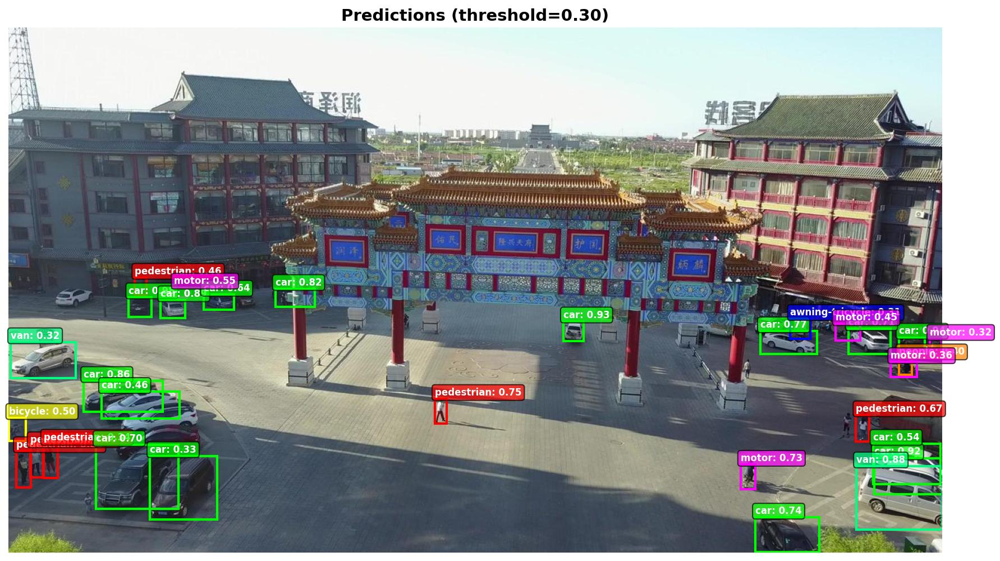
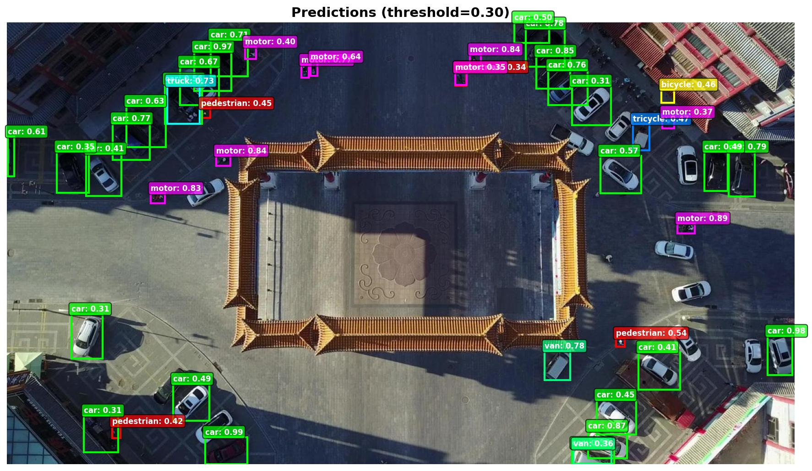
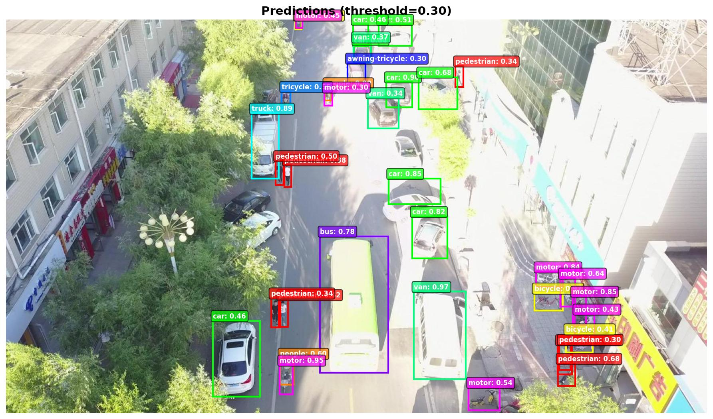
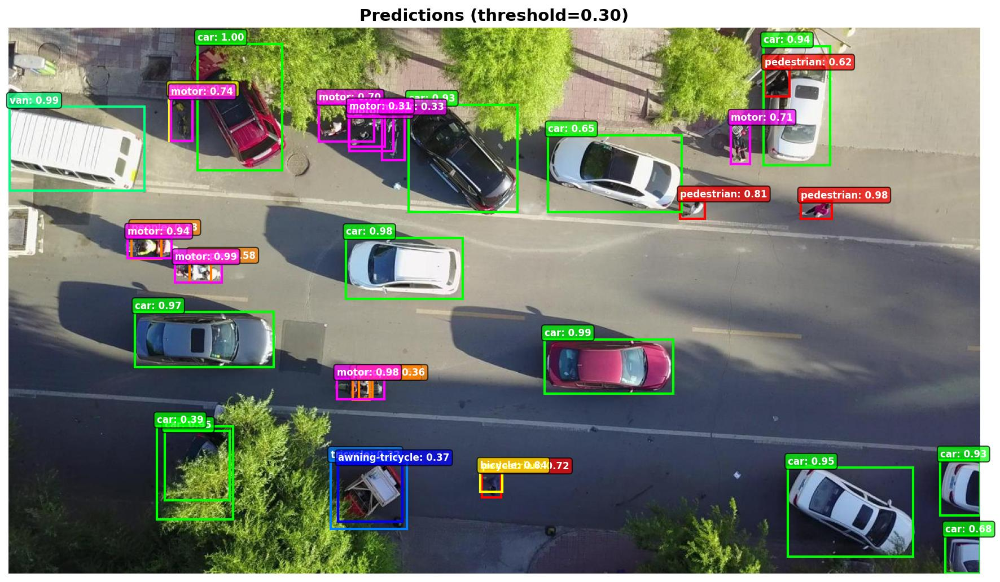

# VisDrone Toolkit 2.0

[](https://www.python.org/downloads/)
[](https://pytorch.org/)
[](LICENSE)
[](https://github.com/psf/black)

Modern PyTorch toolkit for the VisDrone aerial object detection dataset with production-ready training pipelines, real-time inference, and optimizations for small object detection in drone imagery.

---

## What's New in 2.0

**Core Improvements:**

- PyTorch-first design with native Dataset implementation
- Multi-architecture support: Faster R-CNN, FCOS, RetinaNet (ResNet50 & MobileNet variants)
- Real-time webcam inference with pre-trained weights
- Modern format converters (COCO & YOLO, not just VOC)
- Production-ready CLI tools with rich progress tracking
- Advanced training features: data augmentation, multi-scale training, gradient accumulation
- Test-Time Augmentation (TTA) and Soft-NMS for improved accuracy

---

## 📸 Detection Examples

The model demonstrates robust performance across various aerial scenarios from the VisDrone dataset:

<table>
  <tr>
    <td align="center">
      
      <br />
      <b>Urban Traffic Detection</b>
      <br />
      Dense vehicle and pedestrian detection in city intersection
    </td>
    <td align="center">
      
      <br />
      <b>Vertical Orientation</b>
      <br />
      Multi-scale vehicle detection with varying orientations
    </td>
  </tr>
  <tr>
    <td align="center">
      
      <br />
      <b>Weather Effects</b>
      <br />
      Detection of vehicles in extreme sunflare
    </td>
    <td align="center">
      
      <br />
      <b>Mixed Traffic Analysis</b>
      <br />
      Detection of cars, motorcycles, and pedestrians
    </td>
  </tr>
</table>

### Model Performance

The Faster R-CNN ResNet50 model achieves state-of-the-art performance on VisDrone validation set:

| Metric          | Score     |
| --------------- | --------- |
| **F1 Score**    | **66.7%** |
| **Precision**   | 71.0%     |
| **Recall**      | 62.9%     |
| True Positives  | 24,385    |
| False Positives | 9,951     |

**Inference Speed** (RTX 4070 Super 12GB):

- Standard: **55.6ms/image (18 FPS)**
- With TTA + Soft-NMS: ~333ms/image (3 FPS) - best quality

### Usage Notes

- **Recommended threshold**: 0.3-0.5 depending on precision/recall preference
- **Best for**: Top-down or oblique aerial views (10-100m altitude)
- **Challenges**: Objects <15 pixels, heavy occlusion, extreme viewing angles
- **Classes**: Detects 11 object categories (pedestrian, car, van, truck, bicycle, motorcycle, etc.)

---

## Quick Start

```bash
# Install
git clone https://github.com/dronefreak/VisDrone-dataset-python-toolkit.git
cd VisDrone-dataset-python-toolkit
python3 -m venv venv && source venv/bin/activate
pip install -e .

# Test instantly with webcam (no training required)
python scripts/webcam_demo.py --model fasterrcnn_mobilenet

# Train with best practices
python scripts/train.py \
    --train-img-dir data/VisDrone2019-DET-train/images \
    --train-ann-dir data/VisDrone2019-DET-train/annotations \
    --val-img-dir data/VisDrone2019-DET-val/images \
    --val-ann-dir data/VisDrone2019-DET-val/annotations \
    --model fasterrcnn_resnet50 \
    --epochs 200 \
    --batch-size 2 \
    --accumulation-steps 2 \
    --lr 0.005 \
    --amp \
    --augmentation \
    --multiscale \
    --small-anchors \
    --lr-schedule multistep \
    --lr-milestones 60 80 \
    --output-dir outputs/fasterrcnn_improved

# Run inference with TTA + Soft-NMS
python scripts/inference.py \
    --checkpoint outputs/fasterrcnn_improved/best_model.pth \
    --model fasterrcnn_resnet50 \
    --input test_images/ \
    --output-dir results \
    --score-threshold 0.5 \
    --tta \
    --soft-nms \
    --nms-threshold 0.3
```

---

## Features

### Core Components

- **PyTorch Dataset** — Native VisDrone format with automatic filtering and multi-scale support
- **Model Zoo** — 4 detection architectures ready for training
- **Format Converters** — COCO and YOLO export with validation
- **Visualization** — Publication-ready plots and detection overlays
- **CLI Tools** — Train, evaluate, and infer with simple commands

### Training Features

- Mixed precision training (AMP) for 2x speedup
- Gradient accumulation for larger effective batch sizes
- Data augmentation (flips, rotations, color jitter, blur, fog)
- Multi-scale training (600-800px random scaling)
- Small anchor optimization for tiny aerial objects
- Multi-GPU support via DistributedDataParallel
- Learning rate scheduling (step, multistep, cosine)
- Automatic checkpointing with keyboard interrupt handling
- Real-time metrics with rich progress bars

### Inference Features

- Test-Time Augmentation (TTA) with multi-scale + flips
- Soft-NMS post-processing for better recall
- Real-time webcam detection
- Batch processing for images and videos
- Configurable confidence thresholds
- FPS benchmarking and performance profiling

---

## Installation

### Requirements

- Python 3.8+
- CUDA-capable GPU (recommended, 12GB+ VRAM for training)
- PyTorch 2.0+

### Setup

```bash
# 1. Virtual environment
python3 -m venv venv
source venv/bin/activate  # Windows: venv\Scripts\activate

# 2. PyTorch (choose one)
pip install torch torchvision --index-url https://download.pytorch.org/whl/cu118  # GPU
pip install torch torchvision --index-url https://download.pytorch.org/whl/cpu    # CPU

# 3. Install toolkit with dependencies
pip install -e .              # Basic
pip install -e ".[dev]"       # With dev tools
pip install albumentations    # For data augmentation
```

### Dataset Download

Download from [VisDrone Dataset](https://github.com/VisDrone/VisDrone-Dataset):

```bash
data/
├── VisDrone2019-DET-train/
│   ├── images/
│   └── annotations/
└── VisDrone2019-DET-val/
    ├── images/
    └── annotations/
```

See [INSTALL.md](INSTALL.md) for detailed setup instructions.

---

## Usage

### Training

```bash
# Optimized training for best results (200 epochs, ~40 hours on RTX 4070 Super)
python scripts/train.py \
    --train-img-dir data/VisDrone2019-DET-train/images \
    --train-ann-dir data/VisDrone2019-DET-train/annotations \
    --val-img-dir data/VisDrone2019-DET-val/images \
    --val-ann-dir data/VisDrone2019-DET-val/annotations \
    --model fasterrcnn_resnet50 \
    --epochs 200 \
    --batch-size 2 \
    --accumulation-steps 2 \
    --lr 0.005 \
    --amp \
    --augmentation \
    --multiscale \
    --small-anchors \
    --lr-schedule multistep \
    --lr-milestones 60 80 \
    --output-dir outputs/fasterrcnn_200ep

# Fast training for experimentation (50 epochs)
python scripts/train.py \
    --train-img-dir data/VisDrone2019-DET-train/images \
    --train-ann-dir data/VisDrone2019-DET-train/annotations \
    --model fasterrcnn_mobilenet \
    --epochs 50 \
    --batch-size 4 \
    --amp \
    --output-dir outputs/mobilenet_quick

# Resume from checkpoint
python scripts/train.py \
    --resume outputs/fasterrcnn_200ep/checkpoint_epoch_100.pth \
    --epochs 200
```

**Key Training Arguments:**

- `--augmentation` - Enable data augmentation (flips, rotations, color)
- `--multiscale` - Random image scaling 600-800px
- `--small-anchors` - Use 16-256px anchors (vs default 32-512px)
- `--accumulation-steps` - Simulate larger batch (2 steps = 2x batch size)
- `--lr-schedule multistep` - Drop LR at specified milestones
- `--amp` - Mixed precision training (2x speedup)

### Inference

```bash
# Standard inference (fast)
python scripts/inference.py \
    --checkpoint outputs/fasterrcnn_200ep/best_model.pth \
    --model fasterrcnn_resnet50 \
    --input test_images/ \
    --output-dir results \
    --score-threshold 0.5

# Best quality (TTA + Soft-NMS, slower but more accurate)
python scripts/inference.py \
    --checkpoint outputs/fasterrcnn_200ep/best_model.pth \
    --model fasterrcnn_resnet50 \
    --input test_images/ \
    --output-dir results_best \
    --score-threshold 0.5 \
    --tta \
    --soft-nms \
    --nms-threshold 0.3

# Video processing
python scripts/inference.py \
    --checkpoint outputs/fasterrcnn_200ep/best_model.pth \
    --model fasterrcnn_resnet50 \
    --input drone_video.mp4 \
    --output-dir results_video \
    --score-threshold 0.5

# Single image
python scripts/inference.py \
    --checkpoint outputs/fasterrcnn_200ep/best_model.pth \
    --model fasterrcnn_resnet50 \
    --input image.jpg \
    --score-threshold 0.5
```

### Evaluation

```bash
# Evaluate with TTA + Soft-NMS (matches training metrics)
python scripts/evaluate.py \
    --checkpoint outputs/fasterrcnn_200ep/best_model.pth \
    --model fasterrcnn_resnet50 \
    --image-dir data/VisDrone2019-DET-val/images \
    --annotation-dir data/VisDrone2019-DET-val/annotations \
    --score-threshold 0.5 \
    --tta \
    --soft-nms \
    --output-dir eval_results \
    --save-predictions

# Standard evaluation (faster)
python scripts/evaluate.py \
    --checkpoint outputs/fasterrcnn_200ep/best_model.pth \
    --model fasterrcnn_resnet50 \
    --image-dir data/VisDrone2019-DET-val/images \
    --annotation-dir data/VisDrone2019-DET-val/annotations \
    --score-threshold 0.5 \
    --output-dir eval_results
```

### Webcam Demo

```bash
# With trained model
python scripts/webcam_demo.py \
    --checkpoint outputs/fasterrcnn_200ep/best_model.pth \
    --model fasterrcnn_resnet50 \
    --score-threshold 0.5

# With pre-trained COCO weights (no training needed)
python scripts/webcam_demo.py --model fasterrcnn_mobilenet

# Custom camera and threshold
python scripts/webcam_demo.py \
    --checkpoint outputs/fasterrcnn_200ep/best_model.pth \
    --model fasterrcnn_resnet50 \
    --camera 1 \
    --score-threshold 0.7
```

**Controls:** `q` quit | `s` save frame | `SPACE` pause

### Format Conversion

```bash
# To COCO
python scripts/convert_annotations.py \
    --format coco \
    --image-dir data/images \
    --annotation-dir data/annotations \
    --output annotations_coco.json

# To YOLO
python scripts/convert_annotations.py \
    --format yolo \
    --image-dir data/images \
    --annotation-dir data/annotations \
    --output-dir data/yolo_labels
```

### Python API

```python
from visdrone_toolkit import VisDroneDataset, get_model
from visdrone_toolkit.utils import collate_fn
from torch.utils.data import DataLoader
import torch

# Load dataset with augmentation
from training_config import get_training_augmentation

dataset = VisDroneDataset(
    image_dir="data/images",
    annotation_dir="data/annotations",
    transforms=get_training_augmentation(),
    filter_ignored=True,
    filter_crowd=True,
    multiscale_training=True,
)

# Get model with custom configuration
model = get_model("fasterrcnn_resnet50", num_classes=12, pretrained=True)

# Create dataloader
loader = DataLoader(dataset, batch_size=2, collate_fn=collate_fn, shuffle=True)

# Training loop
model.train()
optimizer = torch.optim.SGD(model.parameters(), lr=0.005, momentum=0.9)

for images, targets in loader:
    loss_dict = model(images, targets)
    losses = sum(loss for loss in loss_dict.values())

    optimizer.zero_grad()
    losses.backward()
    optimizer.step()
```

---

## Models

| Model                      | Speed | Accuracy | GPU Memory | Best For                    |
| -------------------------- | ----- | -------- | ---------- | --------------------------- |
| **Faster R-CNN ResNet50**  | ★★★☆☆ | ★★★★☆    | 6GB        | General use, best balance   |
| **Faster R-CNN MobileNet** | ★★★★★ | ★★★☆☆    | 3GB        | Real-time, edge devices     |
| **FCOS ResNet50**          | ★★★☆☆ | ★★★★☆    | 6GB        | Dense objects, anchor-free  |
| **RetinaNet ResNet50**     | ★★★☆☆ | ★★★★☆    | 6GB        | Class imbalance, focal loss |

### Performance Benchmarks

**VisDrone2019-DET-val** (RTX 4070 Super 12GB, batch_size=2):

| Model                 | F1 Score  | Precision | Recall    | FPS (Standard) | FPS (TTA) |
| --------------------- | --------- | --------- | --------- | -------------- | --------- |
| Faster R-CNN ResNet50 | **66.7%** | **71.0%** | **62.9%** | **18**         | **3**     |
| FCOS ResNet50         | 48.8%     | 43.8%     | 55.1%     | 16             | 2.5       |

_Training: 200 epochs with augmentation, multi-scale, small anchors, and optimized hyperparameters_

---

## 🤗 HuggingFace Model Card

Pre-trained weights are available on HuggingFace:

```python
from visdrone_toolkit import get_model
import torch

# Load model with trained weights
model = get_model('fasterrcnn_resnet50', num_classes=12, pretrained=False)
checkpoint = torch.load('path/to/best_model.pth')
model.load_state_dict(checkpoint['model_state_dict'])
model.eval()

# Run inference (see inference.py for complete example)
```

**Model Card**: [dronefreak/visdrone-fasterrcnn-resnet50](https://huggingface.co/dronefreak/visdrone-fasterrcnn-resnet50)

**Training Details**:

- **Dataset**: VisDrone2019-DET (6,471 training images)
- **Epochs**: 200
- **Augmentation**: Horizontal flip, rotation, shift-scale-rotate, color jitter, blur, fog
- **Multi-scale**: Random scaling 600-800px per iteration
- **Optimization**: Small anchors (16-256px), Soft-NMS, lower NMS threshold (0.3)
- **Hardware**: Single RTX 4070 Super (12GB VRAM)
- **Training time**: ~40 hours

---

## Advanced Usage

### Custom Augmentations

```python
import albumentations as A

transform = A.Compose([
    A.HorizontalFlip(p=0.5),
    A.RandomRotate90(p=0.3),
    A.RandomBrightnessContrast(p=0.5),
    A.HueSaturationValue(p=0.3),
], bbox_params=A.BboxParams(format='pascal_voc', label_fields=['labels']))

dataset = VisDroneDataset(
    image_dir="data/images",
    annotation_dir="data/annotations",
    transforms=transform,
    multiscale_training=True,
)
```

### Multi-GPU Training

```python
import torch.distributed as dist
from torch.nn.parallel import DistributedDataParallel

dist.init_process_group(backend='nccl')
model = DistributedDataParallel(model, device_ids=[local_rank])
```

### ONNX Export

```python
import torch

model.eval()
dummy_input = torch.randn(1, 3, 800, 800)
torch.onnx.export(
    model, dummy_input, "model.onnx",
    opset_version=11,
    input_names=['input'],
    output_names=['boxes', 'labels', 'scores']
)
```

---

## Documentation

- [Installation Guide](INSTALL.md) — Detailed setup
- [Quick Reference](QUICKSTART.md) — Command cheatsheet
- [Scripts Documentation](scripts/README.md) — CLI tools
- [Configuration Guide](configs/README.md) — Training configs
- [Test Documentation](tests/README.md) — Running tests
- [Contributing Guide](CONTRIBUTING.md) — Development workflow
- [Changelog](CHANGELOG.md) — Version history

---

## Contributing

Contributions welcome! See [CONTRIBUTING.md](CONTRIBUTING.md) for guidelines.

### Quick Guide

```bash
# Fork and clone
git clone https://github.com/YOUR_USERNAME/VisDrone-dataset-python-toolkit.git

# Setup dev environment
make setup-venv && source venv/bin/activate
make install-dev

# Make changes and test
make format lint test

# Submit PR
git checkout -b feature/your-feature
git commit -m "Add feature"
git push origin feature/your-feature
```

---

## Citation

If you use this toolkit, please cite:

```bibtex
@misc{visdrone_toolkit_2025,
  author = {Saksena, Saumya Kumaar},
  title = {VisDrone Toolkit 2.0: Modern PyTorch Implementation},
  year = {2025},
  publisher = {GitHub},
  url = {https://github.com/dronefreak/VisDrone-dataset-python-toolkit}
}
```

Original VisDrone dataset:

```bibtex
@article{zhu2018visdrone,
  title={Vision Meets Drones: A Challenge},
  author={Zhu, Pengfei and Wen, Longyin and Bian, Xiao and Ling, Haibin and Hu, Qinghua},
  journal={arXiv preprint arXiv:1804.07437},
  year={2018}
}
```

---

## License

Apache License 2.0 — see [LICENSE](LICENSE)

---

## Acknowledgments

- **VisDrone Team** for the dataset
- **PyTorch & Torchvision** for the framework
- All contributors to this project

---

## Roadmap

- [x] Advanced training features (augmentation, multi-scale, gradient accumulation)
- [x] TTA and Soft-NMS post-processing
- [x] Rich progress tracking with metrics
- [ ] VisDrone video task support
- [ ] Weights & Biases integration
- [ ] TensorRT optimization
- [ ] Docker deployment
- [ ] DETR and YOLOv8 architectures
- [ ] Mobile deployment guide

---

**Project Stats:** v2.0.0 | Python 3.8+ | PyTorch 2.0+ | 66 tests | >80% coverage | 66.7% F1 on VisDrone

**Issues & Support:** [GitHub Issues](https://github.com/dronefreak/VisDrone-dataset-python-toolkit/issues)
